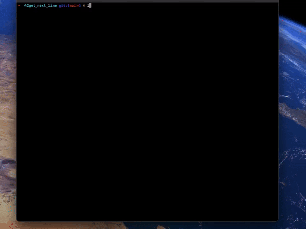

# 42get_next_line

## Reading a line from a fd is way too tedious



A function that reads a line from a file descriptor. 
There is a test file ```main.c``` that you can compile the source files with to test.
The program outputs every line contained in ```text1.txt``` and ```text2.txt``` to the standard output using the ```get_next_line()``` function.

This was my second project in **Hive Helsinki** and it mainly introduced **file descriptors** and **static** variables.

I actually completed this task in late **2022**, but I wanted to redo the commit history and make some minor changes.

## 📖 Topics
  - File descriptors
  - Dynamic memory management
  - Buffer handling
  - Code modularity

## 🛠️ Langs/Tools
  - C

## 🦉 Getting started

  1. ```git clone https://github.com/kenlies/42get_next_line```
  2. ```cd 42get_next_line```
  3. ```gcc main.c get_next_line.c get_next_line_utils.c```

     **or**

     ```gcc main.c get_next_line_bonus.c get_next_line_utils_bonus.c``` for the bonus part
  5. ```./a.out```

## 💸 Bonus section

The bonus of this project required having done the function with only one static variable, which I was already doing. The other condition was that the function should handle multiple file descriptors at the same time. Nothing too laborious. Overall the bonus section for this project added very little to the assignment.

## 🔨 To improve

Making more comprehensive testing files and organize the file structure better.
